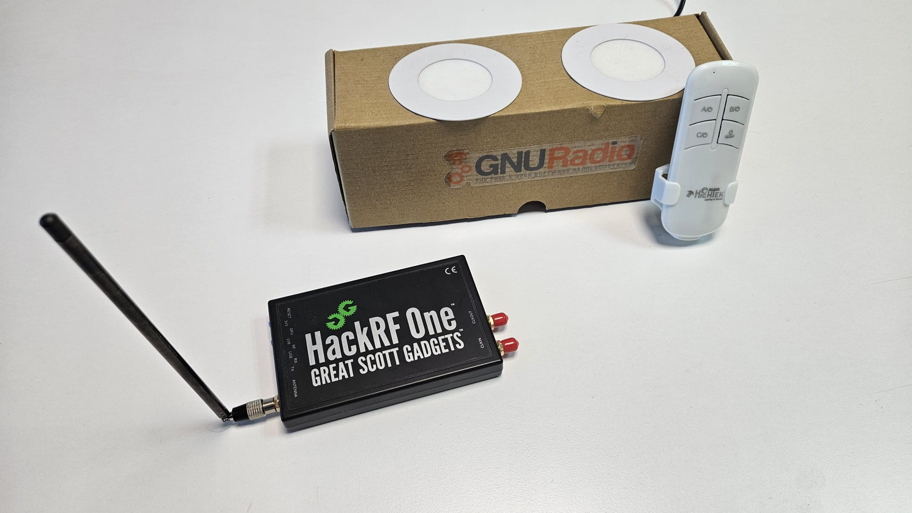

# Simple Replay Attack Demo with GNU Radio

This workshop showcases replay attacks on a mini-setup which includes remote-controlled LED and an off-the-shelf SDR. The workshop aims to show how GNU Radio can be used in every step of a replay attack attempt.  

In the workshop, we will be using a simple RF radio device, a remote control, and a transmit-capable SDR in order to receive and transmit signals. The remote is used to turn on and off the lights. It has A, B, and OnOff buttons onside. We will first search the signal from the original transmitter, capture it, and save it to replay later. In the first part of the workshop, we will use SDR along with GNU Radio to do replay attack with a captured radio signal. In the second part, SDR-device native tools will be utilized to do the same. In the last part, RF data from the remote control will be analyzed and decoded with the help of Inspectrum application, and GNU Radio will be used to synthesize the signal. 
